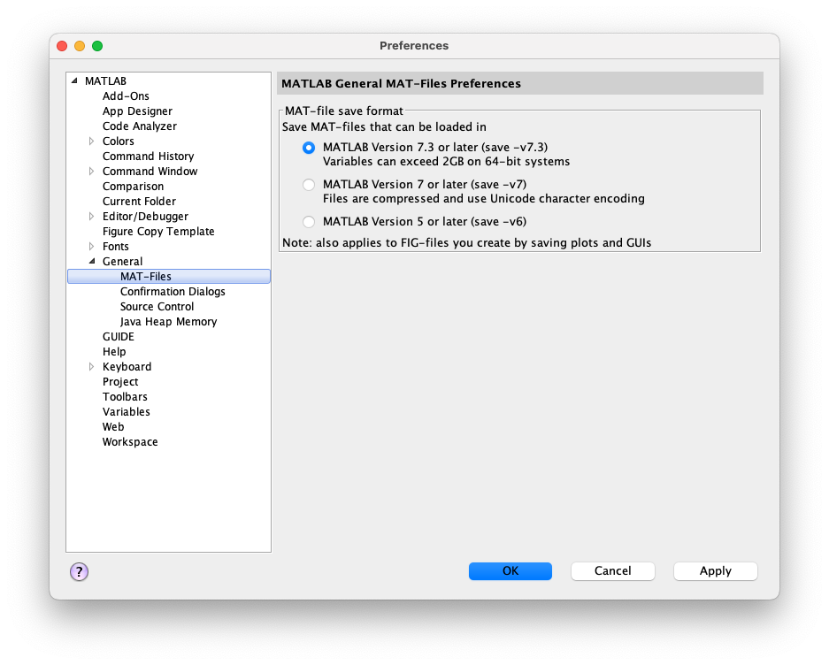
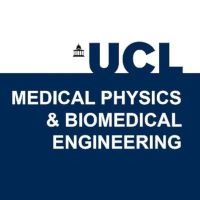
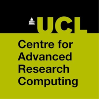

<!-- \cond
 -->
<!-- 👆 this comment and the endcond below, tells doxygen to ignore the badges
and title at the top of README.md when building the project page (the title
would be duplicated) everything else in README.md is also the project homepage. -->

# TDMS · [](https://github.com/UCL/TDMS/releases)  [](https://github.com/UCL/TDMS/blob/main/LICENSE) [](https://github.com/UCL/TDMS/actions/workflows/ci.yml) [](https://github.com/UCL/TDMS/actions/workflows/matlab_tests.yml) [](https://codecov.io/gh/UCL/TDMS) [](https://zenodo.org/badge/latestdoi/448864310)

<!-- \endcond -->

# Time-Domain Maxwell Solver

TDMS, the Time Domain Maxwell Solver, is a hybrid C++ and MATLAB tool for simulating light propagation through a medium by solving Maxwell's equations.
For further details about the method, please refer to the [PDF documentation](https://github.com/UCL/TDMS/blob/gh-doc/masterdoc.pdf).


## Getting started

To use TDMS, it needs to be built against [FFTW](https://www.fftw.org/) and [MATLAB](https://www.mathworks.com/products/matlab.html), which must be downloaded and installed first.
To install, follow these steps:

```bash
$ git clone git@github.com:UCL/TDMS.git
$ cd TDMS
$ git checkout v1.0.0 # the stable version
$ mkdir build; cd build
$ cmake ../tdms \
# -DMatlab_ROOT_DIR=/usr/local/MATLAB/R2019b/ \
# -DFFTW_ROOT=/usr/local/fftw3/ \
# -DCMAKE_INSTALL_PREFIX=$HOME/.local/
$ make install
```

If CMake cannot find MATLAB, FFTW, or install to the default installation prefix, uncomment the relevant line(s) and modify the path(s) accordingly.

<details>
<summary>Mac-specific instructions</summary>

To compile TDMS on a Mac, you will need an x86 compiler with libraries for OpenMP.
You can install these using [Homebrew](https://brew.sh) with the command:

```{sh}
brew install llvm
```

After installing with Homebrew, you may need to set the following CMake arguments:

```{sh}
-DCMAKE_CXX_COMPILER=/Users/username/.local/homebrew/opt/llvm/bin/clang++
-DOMP_ROOT=/Users/username/.local/homebrew/opt/llvm/
-DCXX_ROOT=/Users/username/.local/homebrew/opt/llvm
-DHDF5_ROOT=/Users/username/.local/homebrew/opt/hdf5
```

On an ARM Mac, you will need to install the x86 version of Homebrew.
To do so, use the following commands:

```{sh}
arch -x86_64 zsh
arch -x86_64 /bin/bash -c "$(curl -fsSL https://raw.githubusercontent.com/Homebrew/install/HEAD/install.sh)"
arch -x86_64 /usr/local/bin/brew install llvm hdf5
```
</details>

You can check that `tdms` was installed correctly and is in your `PATH` by running:
```{sh}
tdms --help
```
in a new terminal.

## How to run

You can run TDMS either directly or from a MATLAB script.
For beginners, we recommend starting with the demonstration MATLAB script, which you can find in the `examples/arc_01` directory.
Move into this directory, launch MATLAB, and run the MATLAB script [`run_pstd_bscan.m`](https://github.com/UCL/TDMS/blob/main/examples/arc_01/run_pstd_bscan.m).
This script will generate the input to TDMS, run TDMS, and display sample output.
It also commentates on what it is doing, so you can follow along with what is being setup and created at each stage.
We have also annotated the input file [`arc_01_example_input.m`](https://github.com/UCL/TDMS/blob/main/examples/arc_01/arc_01_example_input.m) that this script passes to `iteratefdtd_matrix.m`.

### MATLAB file version

In order to be readable by TDMS, files need to be saved in .mat (MATLAB file) version 7.3 or newer.
This can be done by passing '-v7.3' to MATLAB's save command as the final argument, for example:

```
save('my_input_file.mat', 'my_input_var_1', 'my_input_var_2', ..., 'my_input_var_N', '-v7.3');
```

<details>
<summary>Or set v7.3 as the default in MATLAB's settings.</summary>



</details>

### On the command line

If you want to run TDMS standalone at the command line, the basic operation is with two arguments: an input file containing simulation parameters, and an output file name.
You can choose between two solver methods: **finite-difference** or **pseudo-spectral**, as well as two interpolation methods: **cubic** or **bandlimited**.
These options can be selected by setting the corresponding flag variables in the input file.
When `tdms` reads the input, it will verify if the input file contains a dataset that matches the names of these flags.

There are two flags available for configuration in the input file.
<details>
<summary> `use_pstd` </summary>
- If not provided, or provided as `false`, then the default timestepping method of finite-differences (FDTD) will be used.
- If present and set to `true`, then `tdms` will use the pseudo-spectral (PSTD) method when performing simulation timesteps.
</details>
<details>
<summary> `use_bli` </summary>
- If not provided, or provided as `false`, then the default interpolation method of cubic interpolation will be used to obtain field values at the centres of Yee cells.
- If present and set to `true`, then `tdms` will use bandlimited interpolation (BLI) when obtaining field values at Yee cell centres.

\note Typically bandlimited interpolation is superior to cubic interpolation when the extent of the Yee cell is of approximately the same order as, but slightly less than, one-sixth of the shortest wavelength of interest.
Otherwise, cubic interpolation typically enjoys superior accuracy.
</details>

TDMS is parallelised with [OpenMP](https://en.wikipedia.org/wiki/OpenMP).
You can set the maximum number of threads using the `OMP_NUM_THREADS` environment variable before calling the TDMS executable.
```{sh}
$ export OMP_NUM_THREADS=4 # for example
```

## Citation

If you used TDMS in your research and found it helpful, please cite this work: [10.5281/zenodo.7950604](https://doi.org/10.5281/zenodo.7950604).

<!-- If you use TDMS in your work and have examples that you would like to share with other users, please get in touch with us at -->
<!-- [contact_address)[mailto:FIXME] -->
<details>
<summary>BibTEX</summary>

```bibtex
@software{tdms,
    author       = {Munro, Peter and others},
    license      = {GPL-3.0},
    title        = {{TDMS - The Time-Domain Maxwell Solver}},
    URL          = {https://github.com/UCL/TDMS},
    publisher    = {Zenodo},
    doi          = {10.5281/zenodo.7950603}
}
```

</details>
<details>
<summary>LaTeX</summary>

```tex
\bibitem{tdms}
P. Munro, et al \emph{TDMS - The Time-Domain Maxwell Solver}, \url{https://github.com/UCL/TDMS}, \href{https://doi.org/10.5281/zenodo.7950603}{10.5281/zenodo.7950603}.
```

</details>

## Acknowledgements

The TDMS source code was released under a GPL-3.0 License as part of a joint project between University College London's [Medical Physics and Biomedical Engineering](https://ucl.ac.uk/medphys) and [Centre for Advanced Research Computing](https://ucl.ac.uk/arc) with generous funding from the [Royal Society](https://royalsociety.org).

&nbsp;

Development of this software has previously benefited from funding from the [Commonwealth Scholarships Commission](https://cscuk.fcdo.gov.uk/about-us/scholarships-and-fellowships/), the [Engineering and Physical Sciences Research Council](https://www.ukri.org/councils/epsrc/), and the [Australian Research Council](https://www.arc.gov.au/).

## Want to contribute?

We're grateful for bug reports, feature requests, and pull requests. Please see our [contribution guidelines](https://github-pages.ucl.ac.uk/TDMS/md__c_o_n_t_r_i_b_u_t_i_n_g.html) (we also have some [developer documentation](https://github-pages.ucl.ac.uk/TDMS/md_doc_developers.html)).
